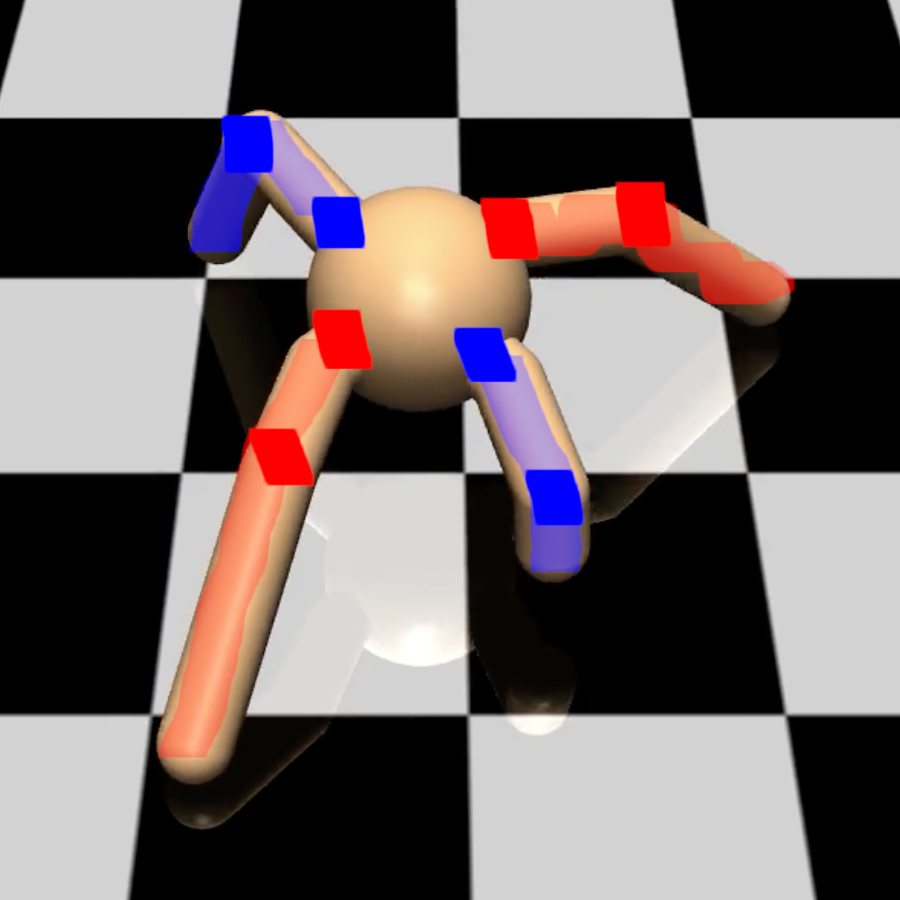
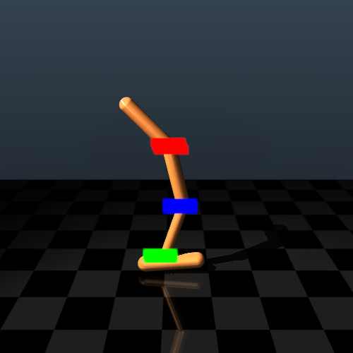
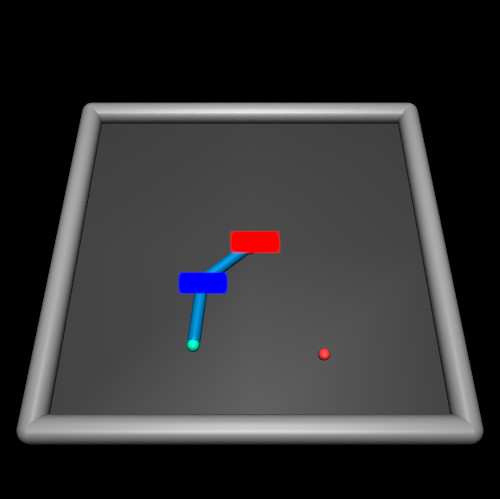
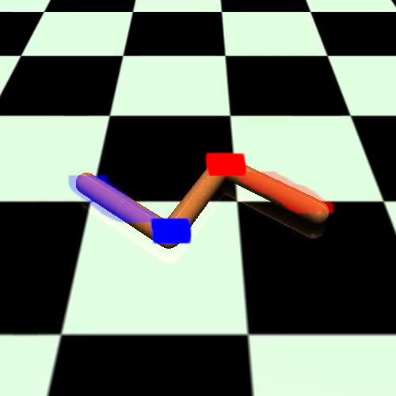

# Multi-Agent Mujoco
Benchmark for Continuous Multi-Agent Robotic Control, based on OpenAI's Mujoco Gym environments.

# Installation

**Note: You require OpenAI Gym Version 10.8.0**
Simply clone this repository and put ./src on your PYTHONPATH.

# Documentation

## Environment config

* *env_args.scenario*: Determines the underlying single-agent OpenAI Gym Mujoco environment
* *env_args.agent_conf*: Determines the partitioning (see in Environment section below), fixed by n_agents x motors_per_agent
* *env_args.agent_obsk*: Determines up to which connection distance k agents will be able to form observations (0: agents can only observe the state of their own joints and bodies, 1: agents can observe their immediate neighbour's joints and bodies).
* *env_args.k_categories*: A string describing which properties are observable at which connection distance as comma-separated lists separated by vertical bars. For example, "qpos,qvel,cfrc_ext,cvel,cinert,qfrc_actuator|qpos" means k=0 can observe properties qpos,qvel,cfrc_ext,cvel,cinert,qfrc_actuator and k>=1 (i.e. immediate and more distant neighbours) can be observed through property qpos. Note: If a property requested is not available for a given agent, it will be silently omitted.
* *env_args.global_categories*: Same as env_args.k_categories, but concerns some global properties that are otherwise not observed by any of the agents. Switched off by default (i.e. agents have no non-local observations).

# Built-in Environments

Environments can be trivially extended by adding entries in src/multiagent_mujoco/obsk.py.

## Multi-Agent Ant-v2

### Ant-v2 2x4


```python
env_args.scenario="Ant-v2"
env_args.agent_conf="4x2"
env_args.agent_obsk=1
```

### Multi-Agent Ant-v2 2x4 diag


```python
env_args.scenario="Ant-v2"
env_args.agent_conf="4x2d"
env_args.agent_obsk=1
```

### Multi-Agent Ant-v2 4x2


```python
env_args.scenario="Ant-v2"
env_args.agent_conf="2x4"
env_args.agent_obsk=1
```
## Multi-Agent HalfCheetah-v2

### Multi-Agent HalfCheetah-v2 2x3


```python
env_args.scenario="HalfCheetah-v2"
env_args.agent_conf="2x3"
env_args.agent_obsk=1
```

### Multi-Agent HalfCheetah-v2 6x1


```python
env_args.scenario="HalfCheetah-v2"
env_args.agent_conf="6x1"
env_args.agent_obsk=1
```

## Multi-Agent Hopper-v2

### Multi-Agent Hopper-v2 3x1


```python
env_args.scenario="Hopper-v2"
env_args.agent_conf="3x1"
env_args.agent_obsk=1
```

## Multi-Agent Humanoid-v2

### Multi-Agent Humanoid-v2 2x8


```python
env_args.scenario="Humanoid-v2"
env_args.agent_conf="2x8"
env_args.agent_obsk=1
```

## Multi-Agent HumanoidStandup-v2

### Multi-Agent HumanoidStandup-v2 2x8


```python
env_args.scenario="HumanoidStandup-v2"
env_args.agent_conf="2x8"
env_args.agent_obsk=1
```


## Multi-Agent Reacher-v2

### Multi-Agent Reacher-v2 2x1


```python
env_args.scenario="Reacher-v2"
env_args.agent_conf="2x1"
env_args.agent_obsk=1
```

## Multi-Agent Swimmer-v2

### Multi-Agent Swimmer-v2 2x1



```python
env_args.scenario="Swimmer-v2"
env_args.agent_conf="2x1"
env_args.agent_obsk=1
```
